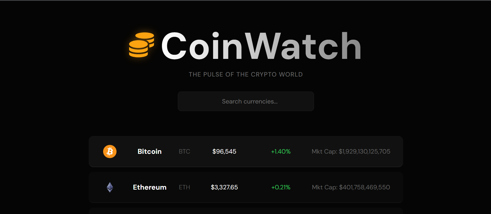

# 🪙 CoinWatch

A React dashboard that tracks cryptocurrency prices in real-time. I built this project to get hands-on experience with API integration and modern CSS layouts.

**[Link to Live Demo](PUT_YOUR_VERCEL_LINK_HERE)**



## 🚀 What it does
* **Live Prices:** Pulls data from the CoinGecko API to show current prices, volume, and market cap.
* **Instant Search:** Filters through the top 100 coins instantly as you type (no page reloads).
* **Dynamic Colors:** Automatically highlights price changes in Red or Green depending on market trends.


## 🛠️ Tech Stack
* **React.js (Vite)**
* **Axios** for API requests
* **Framer Motion** for the slide-in animations
* **CSS3** (Flexbox & Glassmorphism style)

## 🧠 Lessons Learned
Building this helped me solidify a few key React concepts:

* **The "Infinite Loop" Trap:** I learned the hard way why the dependency array `[]` in `useEffect` is so important when fetching API data.
* **CSS Layouts:** I moved away from fixed margins and learned to use `flex-direction`, `justify-content`, and `align-items` to center elements properly on any screen size.
* **State Management:** Gained a better understanding of how `useState` triggers re-renders and how to map over arrays to generate UI components dynamically.

## 💻 Running it locally

1.  **Clone the repo:**
    ```bash
    git clone [https://github.com/YOUR_USERNAME/coin-watch.git](https://github.com/YOUR_USERNAME/coin-watch.git)
    ```
2.  **Install & Run:**
    ```bash
    cd coin-watch
    npm install
    npm run dev
    ```